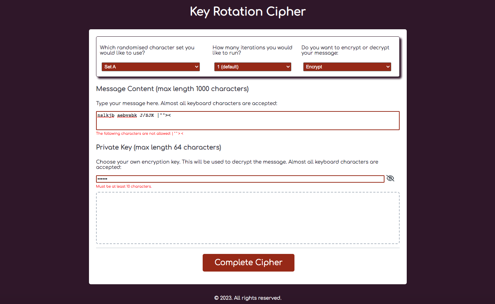

# Key Rotation Cipher

## A rotating Vigenere cipher, interacting with the html elements, and collecting user inputs from a series of validated prompts

### Deployment / Code Repository

[Live deployment](https://tweetingcynical.github.io/key-rotation-cipher/)

[Repository](https://github.com/TweetingCynical/key-rotation-cipher)

### Scope and Purpose

Build an encryption tool that allows a user to input a message and a private key, and then run it through a rotating Caeser cipher / Vigenere cipher, and repeat the process n times, resulting in an output that cannot be as easily brute force decoded as a standard Caesar cipher. The Vigenere complexity will be further increased by using a choice of sets of randomised sequences of the initial character list.

### Installation

N/A

### Pseudocode

Steps to achieving the working generator:

* Declare variables;
* HTML elements to capture:
  - charList choice (charListChoice);
  - user message (userInput);
  - user key (userKey);
  - iteration index (iterationIndex);
* Validate capture options;
* Get indexOf each character from charList. in user message;
* Get indexOf each character from charList in user key;
* Create loop to iterate through user message using Vigenere shift for each character using the following algorithm:

  ```
  To encrypt:
  - Y = new character
  - X = original character
  - Z = key character
  - indexOf(Y) = (indexOf(X) + indexOf(Z)) % charList.choice.length
  - Convert indexOf Y to charList.choice value
  - Add new character Y to string;

  To decrypt:
  - Y = new character
  - X = original character
  - Z = key character
  - indexOf(Y) = (indexOf(X) - indexOf(Z)) % charList.choice.length
  - Convert indexOf Y to charList.choice value
  - Add new character to string;
  ```

* Feed newly created string into the same forloop, using the same key, and repeat n times (iterationIndex);
* Display result (userOutput) in html.


### Overview of Build


## Suggested future changes

- Add show/hide private key option button;


## Screenshot

Working version of site should look like this at standard screen size:


## License

Copyright (c) 2023. All rights reserved.